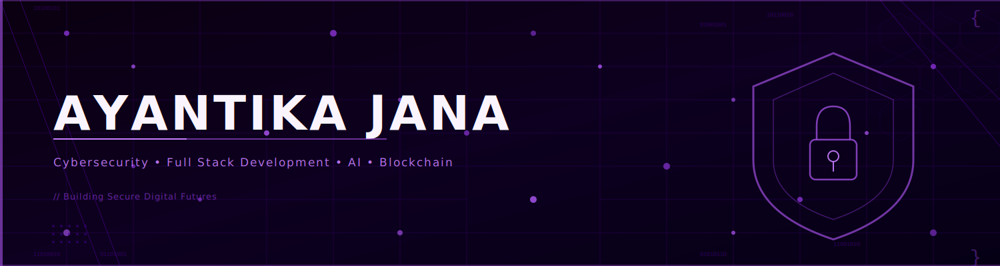

<!-- ══════════════════════════════════════════════════════════ -->
<!--                    HERO BANNER                            -->
<!-- ══════════════════════════════════════════════════════════ -->

 

<!-- ══════════════════════════════════════════════════════════ -->
<!--                    LARGE HEADING                          -->
<!-- ══════════════════════════════════════════════════════════ -->

<h1>
  
</h1>

  

<!-- ══════════════════════════════════════════════════════════ -->
<!--                  ANIMATED TYPING TEXT                     -->
<!-- ══════════════════════════════════════════════════════════ -->

  

<!-- ══════════════════════════════════════════════════════════ -->
<!--                    SOCIAL BADGES                          -->
<!-- ══════════════════════════════════════════════════════════ -->

&nbsp;

&nbsp;

&nbsp;

&nbsp;

 

 

 

<!-- ══════════════════════════════════════════════════════════ -->
<!--                      ABOUT ME                            -->
<!-- ══════════════════════════════════════════════════════════ -->

## `< About Me />`

Focused on the intersection of robust engineering and proactive defense, I design and deploy secure, scalable digital experiences. My work spans end-to-end web applications, machine learning-driven threat detection models, and decentralized solutions—developed with a strong focus on defensive architecture and software integrity.

<b>&nbsp;Read More</b>

 

I'm a **Computer Science student** with a specialization in **Cybersecurity**, passionate about engineering systems that are not just functional — but *resilient*, *secure*, and *intelligent*.

My work spans across the full spectrum of modern software:

- **Cybersecurity** — threat modeling, secure development, and penetration testing concepts
- **Artificial Intelligence & Machine Learning** — building models that detect threats, automate workflows, and generate insights
- **Full Stack Development** — crafting end-to-end web applications with React, Node.js, and Python backends
- **Blockchain** — exploring decentralized systems and smart contract architecture

I thrive at the intersection of security and innovation — where protecting systems requires deeply understanding how they work, and breaking them requires building them better.

> *"The best security is built in, not bolted on."*

 

 

<!-- ══════════════════════════════════════════════════════════ -->
<!--                      TECH STACK                          -->
<!-- ══════════════════════════════════════════════════════════ -->

## `< Tech Stack />`

**Languages**

**Frameworks & Libraries**

**Databases & Tools**

 

 

<!-- ══════════════════════════════════════════════════════════ -->
<!--                   GITHUB ANALYTICS                        -->
<!-- ══════════════════════════════════════════════════════════ -->

## `< GitHub Analytics />`

<table>
  <tr>
    <td align="center" width="50%">
      
    </td>
    <td align="center" width="50%">
      
    </td>
  </tr>
</table>

 

<!-- ══════════════════════════════════════════════════════════ -->
<!--                    GITHUB STREAK                          -->
<!-- ══════════════════════════════════════════════════════════ -->

 

<!-- ══════════════════════════════════════════════════════════ -->
<!--                 CONTRIBUTION GRAPH                        -->
<!-- ══════════════════════════════════════════════════════════ -->

 

<!-- ══════════════════════════════════════════════════════════ -->
<!--                 CONTRIBUTION SNAKE                        -->
<!-- ══════════════════════════════════════════════════════════ -->

<picture>
  <source media="(prefers-color-scheme: dark)" srcset="https://raw.githubusercontent.com/Ayantika2006/Ayantika2006/output/github-snake-dark.svg" />
  <source media="(prefers-color-scheme: light)" srcset="https://raw.githubusercontent.com/Ayantika2006/Ayantika2006/output/github-snake.svg" />
  
</picture>

 

 

<!-- ══════════════════════════════════════════════════════════ -->
<!--                   GITHUB TROPHIES                         -->
<!-- ══════════════════════════════════════════════════════════ -->

## `< Achievements & Trophies />`

 

 

<!-- ══════════════════════════════════════════════════════════ -->
<!--                  FEATURED PROJECTS                        -->
<!-- ══════════════════════════════════════════════════════════ -->

## `< Featured Projects />`

<table>
  <tr>
    <td width="50%" valign="top">
      <h3 align="center">Persistent Flask Backend</h3>
      

        
      

      

        A production-ready, modular Flask application using Docker Compose, integrating a PostgreSQL database with an abstract repository pattern.
      

      

        
        
        
        
      

    </td>
    <td width="50%" valign="top">
      <h3 align="center">Automated Briefing Generator</h3>
      

        
      

      

        AI-driven document summarization tool that auto-generates concise briefings from lengthy reports and articles using NLP and transformer models.
      

      

        
        
        
      

    </td>
  </tr>
  <tr>
    <td width="50%" valign="top">
      <h3 align="center">Love Compatibility Calculator</h3>
      

        
      

      

        Interactive Streamlit web application that calculates user compatibility scores dynamically with progress bars and Valentine-themed styling.
      

      

        
        
      

    </td>
    <td width="50%" valign="top">
      <h3 align="center">Weather Tracking App</h3>
      

        
      

      

        Real-time weather application with location-based forecasting, interactive maps, and 7-day predictions powered by OpenWeatherMap REST API.
      

      

        
        
        
      

    </td>
  </tr>
  <tr>
    <td width="50%" valign="top">
      <h3 align="center">Secure Password Generator</h3>
      

        
      

      

        Cryptographically secure password generator with strength analysis, customizable character sets, and entropy scoring to enforce best security practices.
      

      

        
        
      

    </td>
    <td width="50%" valign="top">
      <h3 align="center">Text Encryption Tool</h3>
      

        
      

      

        Multi-algorithm cryptographic utility implementing AES, DES, and RSA encryption algorithms to safely encode and decode text with a clean Streamlit interface.
      

      

        
        
        
      

    </td>
  </tr>
</table>

 

 

<!-- ══════════════════════════════════════════════════════════ -->
<!--                   CURRENT FOCUS                           -->
<!-- ══════════════════════════════════════════════════════════ -->

## `< Current Focus />`

<table align="center">
  <tr>
    <td align="center">
      
    </td>
    <td align="center">
      
    </td>
    <td align="center">
      
    </td>
    <td align="center">
      
    </td>
    <td align="center">
      
    </td>
  </tr>
</table>

 

 

<!-- ══════════════════════════════════════════════════════════ -->
<!--                    ACHIEVEMENTS                           -->
<!-- ══════════════════════════════════════════════════════════ -->

## `< Recognition />`

| Recognition | Category |
|:-----------:|:--------:|
| **Google Student Ambassador** | Community Leadership |
| **McKinsey Forward Graduate** | Professional Development |
| **Hackathon Finalist** | Competitive Programming |
| **Python Certified Developer** | Technical Certification |
| **JavaScript Certified Developer** | Technical Certification |

 

 

<!-- ══════════════════════════════════════════════════════════ -->
<!--                   CONNECT WITH ME                         -->
<!-- ══════════════════════════════════════════════════════════ -->

## `< Connect With Me />`

Open to opportunities, collaborations, and conversations about cybersecurity, AI, and tech.

 

&nbsp;&nbsp;

&nbsp;&nbsp;

&nbsp;&nbsp;

&nbsp;&nbsp;

 

 

<!-- ══════════════════════════════════════════════════════════ -->
<!--                       FOOTER                              -->
<!-- ══════════════════════════════════════════════════════════ -->

 

  <kbd>Made with purpose. Secured by design.</kbd>
  &nbsp;·&nbsp;
  <kbd>Ayantika Jana &copy; 2025</kbd>
  &nbsp;·&nbsp;
  <kbd>Cybersecurity &middot; AI &middot; Full Stack &middot; Blockchain</kbd>

  

